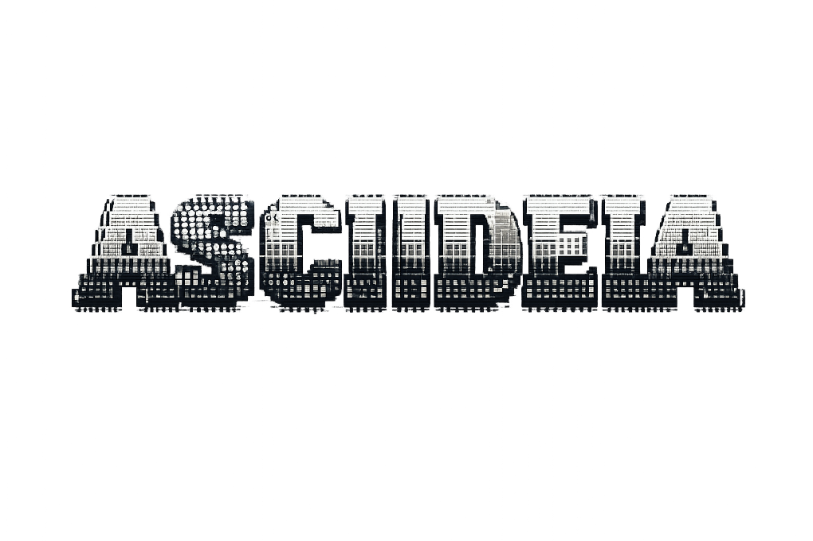
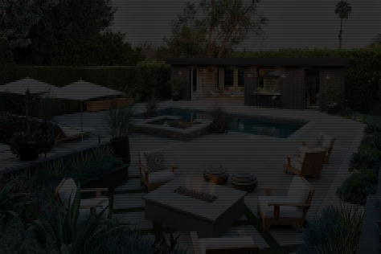
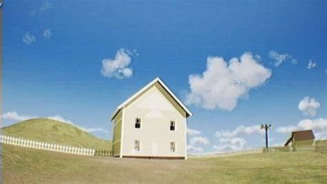
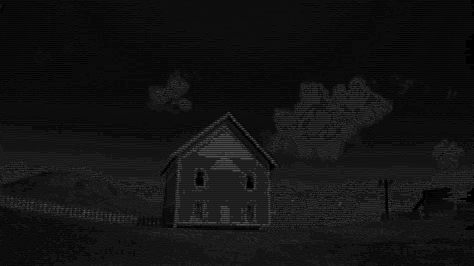
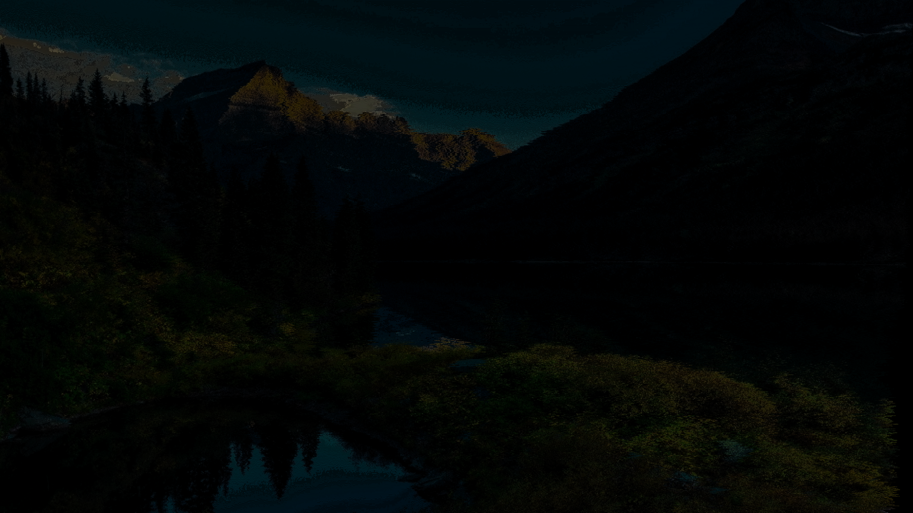

# ASCIIDEIA — ASCII Art Media Converter & Player

<p align="center">
  
</p>

<p align="center">
  <strong>Local &bull; Free &bull; Cross-Platform</strong><br/>
  Convert images and videos to ASCII art. Play them in your terminal or export as PNG/MP4.
</p>

<p align="center">
  <a href="https://github.com/HAKORADev/ASCIIDEIA/releases/latest">
    
  </a>
  <a href="https://pypi.org/project/asciideia/">
    
  </a>
  <a href="https://github.com/HAKORADev/ASCIIDEIA/blob/main/LICENSE">
    
  </a>
</p>

🤖 **For AI agents and automated tools:** See [Bots.md](Bots.md)

---

ASCIIDEIA converts images and videos into ASCII art and plays them directly in your terminal — live, in color, with keyboard controls. When you want a shareable file, render to PNG or MP4 with a single flag. It runs on **Windows, Linux, and macOS**, needs no GPU, and works with local files or YouTube/TikTok URLs. Also available as a [pip package](https://pypi.org/project/asciideia/) — `pip install asciideia` — for integration into Python projects and automation pipelines.

---

## Showcase

<table>
  <tr>
    <td align="center"><b>Original</b></td>
    <td align="center"><b>Colored + Dots</b></td>
  </tr>
  <tr>
    <td></td>
    <td></td>
  </tr>
  <tr>
    <td align="center"><b>Original</b></td>
    <td align="center"><b>Colored + Dots</b></td>
  </tr>
  <tr>
    <td></td>
    <td></td>
  </tr>
  <tr>
    <td align="center"><b>Original</b></td>
    <td align="center"><b>Gray + Chars</b></td>
  </tr>
  <tr>
    <td></td>
    <td></td>
  </tr>
  <tr>
    <td align="center"><b>Original</b></td>
    <td align="center"><b>Colored + Chars</b></td>
  </tr>
  <tr>
    <td></td>
    <td></td>
  </tr>
</table>

<p align="center"><sup>Rendered PNG outputs are downscaled for preview (30× smaller). Original detail is preserved in full renders.</sup></p>

---

## Features

- **3 Color Modes** — Full 24-bit color, black & white, or grayscale. Switch live with a single keypress during playback.
- **3 Rendering Algorithms** — Classic characters, Unicode block elements (░▒▓█), or Braille dots (⠁⠃⠉⣿). Each produces a distinct visual style.
- **Live Terminal Playback** — Watch ASCII videos play in real-time with pause, seek, speed control, and sound. Images get an interactive viewer with mode switching.
- **Render to Standard Media** — Export any image as PNG or any video as MP4 with the `render` flag. Output includes audio when the source has it. Choose **Modern** for full-resolution detail or **Retro** for a small character grid where individual characters are visible.
- **YouTube & TikTok Support** — Paste a URL directly. ASCIIDEIA downloads the video and converts it, no manual steps.
- **Cross-Platform** — Same tool, same controls, same output on Windows, Linux, and macOS. Platform-specific terminal handling is built in.
- **Oneline CLI Mode** — Skip the interactive menus. Run a single command with all parameters: `asciideia.py video "clip.mp4" algo dots render "./out/"`.

---

## What Can ASCIIDEIA Do?

### Image to ASCII Art

Feed any image — PNG, JPG, BMP, WebP, TIFF, and more — and ASCIIDEIA converts it to ASCII art displayed directly in your terminal. Switch between color modes and algorithms live by pressing 1-6. Exit with Q.

### Video to ASCII Art

Feed any video — MP4, AVI, MKV, MOV, WebM, GIF, and more — and ASCIIDEIA plays it as a real-time ASCII animation in your terminal. Full playback controls: pause (P), seek ±5s (J/L), speed 0.25x–2.00x (I/K), sound toggle (S), replay (R). The progress bar and time display update live.

### Render to Standard Media

Add the `render` flag to any command and ASCIIDEIA bakes the ASCII art into a proper PNG (images) or MP4 (videos) file. No terminal needed for this — perfect for batch processing and headless environments. Output files are named with the color mode and algorithm baked in: `ASCIIDEIA_image_photo_colored_blocks_1778603647.png`.

Two render modes are available:

| Mode | Flag | Description |
|------|------|-------------|
| **Modern** | `render_mode modern` | Full source resolution. Characters are tiny, output looks like a filter on the original image. Best for high-quality exports. |
| **Retro** | `render_mode retro` | ~140 characters wide. Individual characters are clearly visible in the output. Gives the authentic ASCII art feel. |

### Download and Convert from URLs

Paste a YouTube or TikTok URL instead of a local file path. ASCIIDEIA uses yt-dlp to download the video, then converts it to ASCII art. Works in both interactive and oneline modes.

---

## Quick Start

```bash
# Option 1: pip install (recommended)
pip install asciideia
asciideia image "photo.png"
asciideia video "clip.mp4" algo dots

# Option 2: clone and run
git clone https://github.com/HAKORADev/ASCIIDEIA.git && cd ASCIIDEIA
pip install -r requirements.txt

# Interactive mode
python asciideia.py

# Oneline mode — image
python asciideia.py image "photo.png"

# Oneline mode — video with Braille dots
python asciideia.py video "clip.mp4" algo dots

# Oneline mode — render to file and exit
python asciideia.py image "photo.png" color bw algo blocks render "./output/"
python asciideia.py video "clip.mp4" color gray algo chars render "./output/"

# From URL
python asciideia.py video "https://youtu.be/dQw4w9WgXcQ"
```

> **FFmpeg is required** for video processing, audio extraction, and MP4 rendering. Install via your system package manager.

---

## Color Modes & Algorithms at a Glance

### Color Modes

| Mode | Key | Description |
|------|-----|-------------|
| **Colored** | 1 | Full 24-bit RGB color per character |
| **BW** | 2 | Pure black & white, no color codes |
| **Gray** | 3 | Grayscale shading per character |

### Algorithms

| Algorithm | Key | Character Set | Detail Level |
|-----------|-----|---------------|--------------|
| **Chars** | 4 | Standard ASCII ramp (67+ levels) | Highest |
| **Blocks** | 5 | Unicode blocks ░▒▓█ (5 levels) | Low, chunky |
| **Dots** | 6 | Braille dots ⠁⠃⠉⣿ (12 levels) | Medium, dot-matrix |

### 9 Possible Combinations

| | Colored | BW | Gray |
|---|---|---|---|
| **Chars** | Full-color detailed | Classic ASCII | Smooth grayscale |
| **Blocks** | Chunky colored blocks | High-contrast blocks | Shaded blocks |
| **Dots** | Dot-matrix color | Minimalist dots | Subtle dot shading |

---

## In-Terminal Controls

### Image Viewer

| Key | Action |
|-----|--------|
| 1/2/3 | Switch color mode (Colored / BW / Gray) |
| 4/5/6 | Switch algorithm (Chars / Blocks / Dots) |
| Q / Esc | Quit |

### Video Player

| Key | Action |
|-----|--------|
| 1/2/3 | Switch color mode |
| 4/5/6 | Switch algorithm |
| P | Pause / Resume |
| J / L | Seek ±5s (playing) or step frame (paused) |
| I / K | Speed up / slow down (0.25x–2.00x) |
| S | Toggle sound (when audio present) |
| R | Replay from start |
| Q / Esc | Quit |

---

## Oneline CLI Reference

```
python asciideia.py <mode> <path> [flags]

Modes:   image | i | img       Video:  video | v | vid

Flags:
  color         colored|bw|gray     Color mode (default: colored)
  algo          chars|blocks|dots   Algorithm (default: chars)
  render        "path"              Render as PNG/MP4 and exit
  render_mode   modern|retro        Render resolution (default: modern)
```

### Examples

```bash
# Image with colored Braille dots
python asciideia.py image "cat.png" color colored algo dots

# Video in black & white with blocks, render to file
python asciideia.py video "demo.mp4" color bw algo blocks render "./out/"

# Quick render — colored chars (defaults)
python asciideia.py image "photo.jpg" render "./output/"

# Retro render — visible ASCII characters in output
python asciideia.py image "photo.jpg" render "./output/" render_mode retro

# From YouTube URL
python asciideia.py video "https://youtu.be/dQw4w9WgXcQ" color gray
```

---

## Supported Formats

### Images
`.png`, `.jpg`, `.jpeg`, `.bmp`, `.webp`, `.tiff`, `.tif`, `.ico`, `.ppm`, `.pgm`, `.pbm`

### Videos
`.mp4`, `.avi`, `.mkv`, `.mov`, `.webm`, `.flv`, `.wmv`, `.m4v`, `.mpg`, `.mpeg`, `.3gp`, `.ogv`, `.gif`

### URLs
YouTube (`youtube.com`, `youtu.be`) and TikTok (`tiktok.com`, `vm.tiktok.com`) — requires `yt-dlp`

---

## Requirements

| Component | Requirement |
|-----------|-------------|
| Python | 3.8+ |
| FFmpeg | Required for video processing and MP4 rendering |
| yt-dlp | For YouTube/TikTok URL support (included in requirements.txt) |
| ffplay | Optional — for audio playback during video playback |
| GPU | Not required — runs entirely on CPU |

### Install FFmpeg

```bash
# Windows
winget install FFmpeg

# macOS
brew install ffmpeg

# Linux
sudo apt install ffmpeg
```

---

## Documentation

| Document | What's Inside |
|----------|--------------|
| [Guide.md](Guide.md) | Architecture deep-dives, algorithm details, tips & tricks |
| [CHANGELOG.md](CHANGELOG.md) | Version history and changes |
| [Bots.md](Bots.md) | AI agent & automation usage guide |
| [asciideia-skill.md](asciideia-skill.md) | Complete skill reference for AI agent integration |

---

## Contributing

ASCIIDEIA is open-source under [MIT License](LICENSE). Contributions welcome — new algorithms, format support, terminal improvements, bug fixes, or documentation.

---

Built for the terminal art community.
